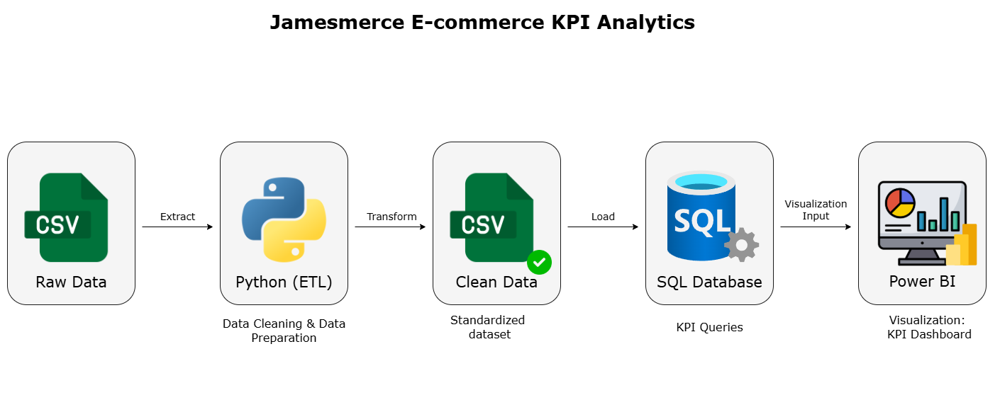

# Project01: 📊 E-commerce Sales KPI Analytics Project - Jamesmerce E-commerce

This project analyzes e-commerce sales data through an **Python ETL → SQL → Power BI** pipeline to generate KPI reports and interactive dashboards that support business decision-making.  

---
## Project Pipeline

## Step by Step

### 1. ETL with Python
- Cleaned and standardized raw sales data (dates, customer names, discounts).
- Handled missing values, removed outliers, and converted data types.
- Recalculated profit margin for more accurate analysis.
- Exported the cleaned dataset as `Jamesmerce__Clean_Data.csv` for SQL queries and dashboards.

### 2. SQL – KPI Queries
1. **Import the cleaned dataset into the SQL Database.**
2. **Write SQL queries to calculate the main KPIs:**
   - Total Revenue  
   - Revenue by Discount Level  
   - Total Profit  
   - Overall Profit Ratio  
   - Profit by Discount Level  
   - Quantity  
   - Quantity by Discount Level  
   - Discount  
   - Total Discount  

### 3. Power BI – KPI Dashboard
- Connect Power BI to the cleaned CSV file.  
- Create DAX measures for KPI calculations.  
- Build **KPI Cards** for Revenue, Profit, Orders, and Avg. Discount.  
- Design an interactive dashboard including:
  - Revenue & Profit over time (Year/Month).  
  - Revenue & Profit by Discount Level.  
  - Quantity of products sold by Discount Level.  
  - Quantity of products sold by Category.  
  - Regional analysis by State.  
  - KPI Growth (compared to the previous month and year).  

