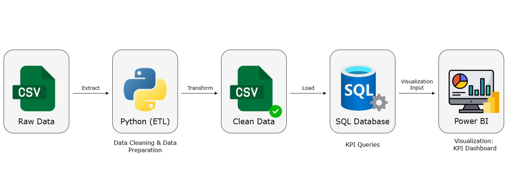

# Project 01: E-commerce Sales Analytics Project - Jamesmerce E-commerce

This project analyzes e-commerce sales data (over 10,000 rows, covering January 2013 to December 2016 in the United States) through a Python ETL → SQL → Power BI pipeline to generate KPI reports and interactive dashboards that support business decision-making.  

---
## Project Pipeline

## Project Dashboard

## Project Purpose & Audience
### Purpose
- **KPI Monitoring**: Track revenue, profit, margin, discounts, and sales volume.  
- **Product & Customer Insights**: Identify top profit drivers, analyze category/segment contributions.  
- **Policy Evaluation**: Assess the effectiveness of discount strategies on profit.  
- **Trend & Seasonality Analysis**: Detect recurring seasonal downturns to support proactive planning.  

### Audience
- **Executive Management and Senior Business Leaders** (CEO, CFO, Head of Sales/Marketing).

## Step by Step

### 1. ETL with Python
- Cleaned and standardized raw sales data (dates, customer names, discounts).
- Handled missing values, removed outliers, and converted data types.
- Recalculated profit margin for more accurate analysis.
- Exported the cleaned dataset as `Jamesmerce_Clean_Data.csv` for SQL queries and dashboards.

### 2. SQL – KPI Queries
1. **Import the cleaned dataset into the SQL Database.**
2. **Write SQL queries to calculate the main KPIs:**
   - Total Revenue  
   - Revenue by Discount Level  
   - Total Profit  
   - Overall Profit Ratio  
   - Profit by Discount Level  
   - Quantity  
   - Quantity by Discount Level  
   - Discount  
   - Total Discount  

### 3. Power BI – KPI Dashboard
- Connect Power BI to the cleaned CSV file.
- Standardized data using Power Query. 
- Create DAX measures for KPI calculations.  
- Build **KPI Cards** for Revenue, Profit, Orders, and Avg. Discount.  
- Design an interactive dashboard including:
  - Revenue & Profit over time (Year/Month).  
  - Revenue & Profit by Discount Level.  
  - Quantity of products sold by Discount Level.  
  - Quantity of products sold by Category.  
  - Top 5 highest-profit products.  
  - KPI Growth (compared to the previous month and year).
  
## Key Achievements
- Reduced reporting time by about 70% compared to manual Excel-based reporting through automated data cleaning and dashboard updates, thereby optimizing time and work efficiency.  
- Improved data accuracy and consistency by implementing standardized ETL processes and SQL validation checks.  
- Delivered interactive dashboards that provided clear insights into profit drivers, discount impact, and sales trends, enabling faster and more informed business decisions.  

